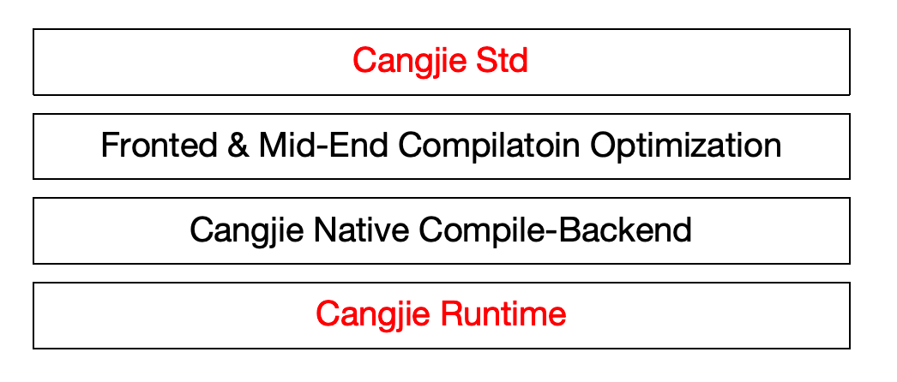

# Cangjie Runtime and Cangjie Standard Library

## Introduction

The Cangjie runtime is one of the core components of the Cangjie Native backend (CJNative), designed with high performance and lightweight as its goals, and provides strong support for the high performance of the Cangjie language in all scenarios. For more information on Cangjie runtime, please refer to [Cangjie Runtime](https://gitcode.com/Cangjie/cangjie_runtime/blob/main/runtime/README.md).

The Cangjie standard library (std) provides developers with the most common APIs, including input and output functions, basic data structures and algorithms, date and time representations, and more. For more information on Cangjie std, please refer to [Cangjie Std](https://gitcode.com/Cangjie/cangjie_runtime/blob/main/std/README.md).



## Directory Structure

```
/cangjie_runtime
├─ runtime                 # Cangjie Runtime, including memory management, Cangjie thread management, etc
└─ std                     # The std module provides developers with the most common APIs
```

## Building

[Build the runtime](https://gitcode.com/Cangjie/cangjie_runtime/blob/main/runtime/README.md)

[Build the std](https://gitcode.com/Cangjie/cangjie_runtime/blob/main/std/README.md)

For more information on integrating and building with the Cangjie SDK, please refer to [the Cangjie SDK Integration and Build Guide](https://gitcode.com/Cangjie/cangjie_build/blob/dev/README_zh.md)

## Repositories Involved

[cangjie_compiler](https://gitcode.com/Cangjie/cangjie_compiler)

[**cangjie_runtime**](https://gitcode.com/Cangjie/cangjie_runtime)

[cangjie_tools](https://gitcode.com/Cangjie/cangjie_tools)

[cangjie_stdx](https://gitcode.com/Cangjie/cangjie_stdx)

[cangjie_docs](https://gitcode.com/Cangjie/cangjie_docs)

[cangjie_build](https://gitcode.com/Cangjie/cangjie_build)

[cangjie_test](https://gitcode.com/Cangjie/cangjie_test)
