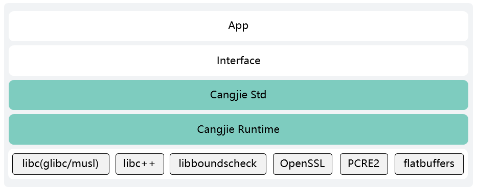
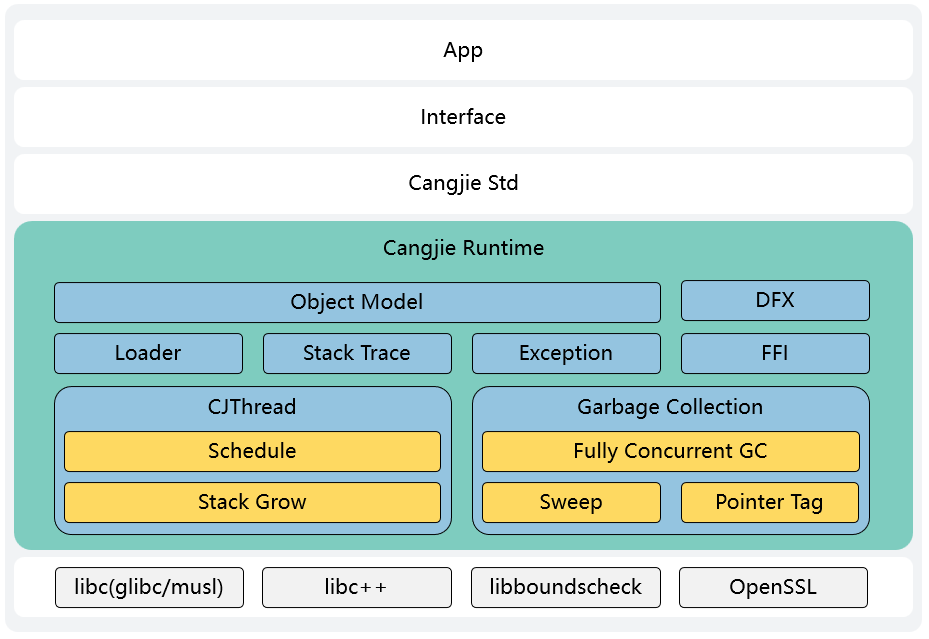
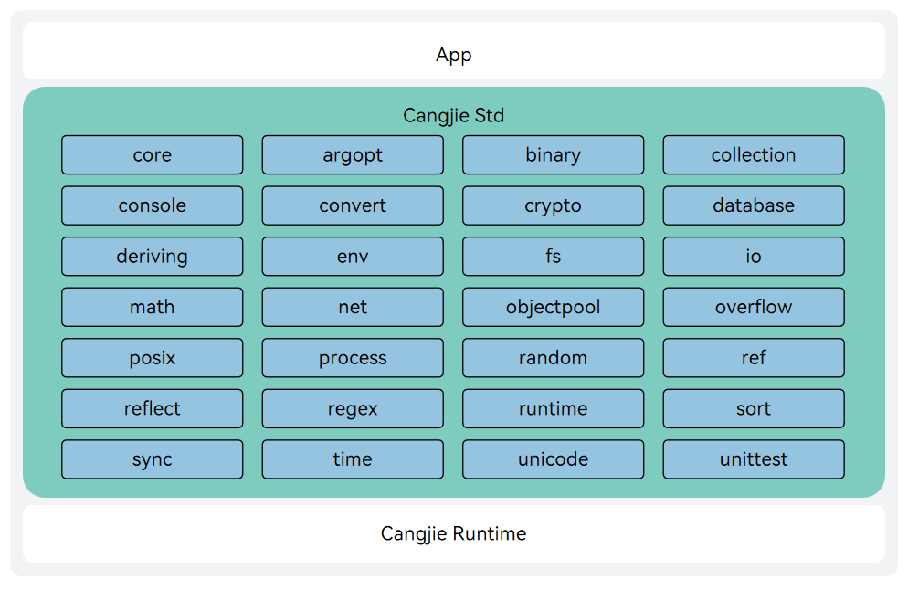

# Cangjie Runtime and Cangjie Standard Library (beta feature)

In the Cangjie programming language, program execution depends on the capabilities of the runtime and standard library. The Cangjie Runtime, as a lightweight and efficient fundamental engine, is responsible for managing core resources such as memory and threads during program execution. The Cangjie Language Standard Library provides feature-rich built-in libraries covering data structures, common algorithms, mathematical computations, regular expressions, system interactions, file operations, network communications, and other functionalities, which can meet most development needs.

This repository provides the source code for the Cangjie Runtime and Cangjie Programming Language Standard Library. The overall structure diagram is shown below:



> Usage of Third-Party Libraries
> - `libboundscheck` is used by the Cangjie Runtime and Cangjie Programming Language Standard Library. It is source code dependent and will be compiled and integrated into binary release packages.
> - `OpenSSL` is used by the Cangjie Runtime. It dynamically links to the system's dynamic libraries without source code dependency.
> - `PCRE2` is used by the standard library `regex`. It is source code dependent and will be compiled and integrated into binary release packages.
> - `flatbuffers` is used by the standard library `ast`. It is source code dependent and will be compiled and integrated into binary release packages.

For details on third-party dependencies, see the [Third-Party Library Documentation](./stdlib/third_party/README.md).

Below is a detailed introduction to the Cangjie Runtime and the Cangjie Programming Language Standard Library.

## Cangjie Runtime

### Introduction

The Cangjie runtime is one of the core components of the Cangjie Native backend (CJNative), designed with high performance and lightweight as its goals, and provides strong support for the high performance of the Cangjie language in all scenarios. As the fundamental engine for running Cangjie programs, the Cangjie runtime provides basic driving functions such as garbage collection (GC), CJThread, and loader.

### System Architecture

The architecture diagram of Cangjie Runtime is shown below:



**Cangjie Runtime Architecture**

- **Garbage Collection** uses a low-latency, fully concurrent memory compact algorithm, with the core goal of achieving lower latency and lower memory overhead, helping developers focus better on the programming itself.
    - Fully Concurrent GC：Eliminate Stop-The-World (STW) pauses and optimize execution latency.
    - Sweep：Defragment heap memory through object relocation to improve memory utilization and support long-running applications.
    - Pointer Tag：Apply pointer tagging at reference to distinguish between garbage memory and newly reused memory, ensuring correctness of fully concurrent GC.

- **CJThread** provides a lighter and more flexible thread management solution, capable of better handling various scales of concurrent scenarios.
    - Schedule：The Schedule encompasses fundamental modules such as thread, monitor, processor, and schmon. Each module undertakes distinct responsibilities, enabling the Cangjie runtime to fully leverage multi-core hardware resources and further scale its concurrency capabilities.
    - Stack Grow：CJThread employs a contiguous stack that automatically doubles in size once it reaches its capacity limit.

- **Exception** provides Two types of exception handling mechanisms, categorized by severity into `Exceptions` and `Errors`:
    - `Exception` represents exceptions caused by runtime logical errors or `IO` failures, such as array index out of bounds or attempting to open a non-existent file. These exceptions must be explicitly caught and handled in the program.
    - `Error` represents internal system errors and resource exhaustion conditions within the Cangjie runtime. Applications should not throw errors of this type. When an internal error occurs, the application should notify the user and terminate safely as soon as possible.

- **Stack Trace** implements a frame-pointer-based stack unwinding mechanism where the `rbp` register stores the base address of the current stack frame, and the `rsp` register stores the stack top pointer. Upon function calls, the address of the previous stack frame is pushed onto the stack for preservation.

- **Loader** supports loading and managing Cangjie code at the package granularity, with reflection capabilities.

- **Object Module** contains Cangjie object metadata, member information, method details, and method tables. Support for the creation, management, invocation, and release of Cangjie objects.

- **FFI** enables function calls and data exchange between the Cangjie and `C/ArkTS`.

- **DFX** provides debugging and tuning capabilities such as log, `CPU` profiling, heap snapshot, and supports runtime state inspection and fault diagnosis.

### Directory Structure

```
/cangjie_runtime
├── runtime
│   ├── build            # Build scripts
│   └── src
│       ├── Base         # Basic function module
│       ├── CJThread     # Cangjie thread management module
│       ├── Common       # Common module
│       ├── Concurrency  # Concurrency management module
│       ├── CpuProfiler  # CPU Profiling module
│       ├── Demangler    # Symbol demangling module
│       ├── Exception    # Exception handling module
│       ├── Heap         # Heap memory management module
│       ├── Inspector    # DFX Utilities
│       ├── Loader       # Cangjie Loader
│       ├── Mutator      # Mutator state management module
│       ├── ObjectModel  # Object model
│       ├── Signal       # Signal management module
│       ├── StackMap     # Stack metadata analysis module
│       ├── Sync         # Synchronization primitive implementation module
│       ├── UnwindStack  # Stack unwinding module
│       ├── Utils        # General Utility Classes
│       ├── arch         # Hardware platform adaptation code
│       └── os           # Software platform adaptation code
└── stdlib
```

### Constraints

Currently, building the Cangjie Runtime within the Windows environment is not supported. To generate Cangjie Runtime build artifacts that can run on the Windows platform, cross-compilation in a Linux environment is required. For detailed information, please refer to [Cangjie SDK Integration and Build Guide](https://gitcode.com/Cangjie/cangjie_build/blob/dev/README_zh.md). For specific future support plans, please see [Platform Support Plan](#platform-support-plan).

### Compilation & Build

To build the Cangjie Runtime, please refer to [Build Cangjie Runtime](./runtime/build_runtime.md) for details.

### Usage

The standalone build outputs must be used together with the `cjc` compiler and the standard library. The complete bundle runs out-of-the-box on Linux, macOS, Windows, and OpenHarmony systems.
For integration details, please refer to the [Cangjie SDK Integration and Build Guide](https://gitcode.com/Cangjie/cangjie_build).

## Cangjie Programming Language - Standard Library (std)

### Introduction

The Cangjie programming language’s standard library (std) is an officially provided library that predefines a set of functions, classes, structs, and more. Its purpose is to offer common features and tools, enabling developers to write programs more quickly and efficiently.

The Cangjie Standard Library has three key characteristics and goals:

- Convenience: The standard library is distributed with the compiler and toolchain, requiring no additional downloads from users, making it ready to use right out of the box.
- Universal Functionality: The standard library provides the most commonly used library capabilities for developers, aiming to solve most basic problems.
- Quality Benchmark: The standard library strives to set an example and benchmark for other Cangjie libraries in terms of performance, code style, etc.


For a detailed introduction and usage of the standard library, please refer to the [official standard library documentation](https://cangjie-lang.cn/docs?url=%2F1.0.0%2Flibs%2Fstd%2Fstd_module_overview.html).

### System Architecture

The architecture diagram of the Cangjie standard library is shown below:



### Directory

The main directories are as follows:

```
/cangjie_runtime
├── runtime
└── stdlib
    └── libs
        └── std
            ├── argopt      # Command line argument string parsing
            ├── ast         # Syntax parser
            ├── binary      # Provides interfaces for endian conversion of basic data types and binary byte arrays, as well as endian reversal interfaces
            ├── collection  # Implementation of common data structures, definition of relevant abstract interfaces, and common function features in collection types
            ├── console     # Provides methods for interacting with standard input, standard output, and standard error
            ├── convert     # Provides Convert series functions for converting from strings to specific types and formatting capabilities
            ├── core        # Core package of the standard library
            ├── crypto      # Symmetric encryption/decryption and common digest algorithm capabilities
            ├── database    # Cangjie database access capabilities
            ├── deriving    # Provides a set of macros to automatically generate interface implementations
            ├── env         # Provides information and functionality related to the current process
            ├── fs          # File library
            ├── io          # Provides the ability for programs to exchange data with external devices
            ├── math        # Math library
            ├── net         # Network communication
            ├── objectpool  # Object caching
            ├── overflow    # Overflow handling
            ├── posix       # POSIX system interface adaptation
            ├── process     # Process library
            ├── random      # Provides the ability to generate pseudo-random numbers
            ├── ref         # Provides weak reference capabilities
            ├── reflect     # Reflection functionality
            ├── regex       # Regular expression library
            ├── runtime     # Runtime interaction
            ├── sort        # Sorting
            ├── sync        # Concurrent programming
            ├── time        # Time library
            ├── unicode     # Character processing
            └── unittest    # For writing unit test code for Cangjie projects
```

### Constraints

Building the Cangjie runtime is supported on Ubuntu/MacOS (x86_64, aarch64) environments. For more details on environment and tool dependencies, please refer to the [Build Dependency Tools](https://gitcode.com/Cangjie/cangjie_build/blob/dev/docs/env_zh.md).

Currently, building the Cangjie Programming Language Standard Library within the Windows environment is not supported. To generate Standard Library artifacts that can run on the Windows platform, cross-compilation in a Linux environment is required. For detailed information, please refer to  [Cangjie SDK Integration and Build Guide](https://gitcode.com/Cangjie/cangjie_build/blob/dev/README_zh.md). For specific future support plans, please see [Platform Support Plan](#platform-support-plan).

### Compilation and Building

To build the Cangjie Programming Language Standard Library, please refer to [Build Cangjie Standard Library](./stdlib/build_std.md) for details.

### Usage Instructions

The standard library build artifacts need to be used with the cjc compiler and runtime, etc. For specific integration methods, please see the [Cangjie Programming Language Standard Library API](./stdlib/doc/libs/summary_cjnative_EN.md).

### Platform Support Plan
- Build Platform Evolution: Plan to support Cangjie applications running on the OHOS-ARM32 platform on October 20, 2025. Advanced features such as reflection, dynamic loading capabilities, and some compiler optimizations are planned to be supported in Q4 2025.

## Repositories Involved

[cangjie_compiler](https://gitcode.com/openharmony-sig/third_party_cangjie_compiler)

[cangjie_tools](https://gitcode.com/openharmony-sig/third_party_cangjie_tools)

[cangjie_stdx](https://gitcode.com/openharmony-sig/third_party_cangjie_stdx)

[cangjie_docs](https://gitcode.com/Cangjie/cangjie_docs)

[cangjie_build](https://gitcode.com/Cangjie/cangjie_build)

[cangjie_test](https://gitcode.com/Cangjie/cangjie_test)

## Open Source License
This project is licensed under [Apache-2.0 with Runtime Library Exception](./LICENSE). Please enjoy and participate in open source freely.

## Contribution Guide

Welcome all developers to contribute code, documentation, and more. For specific contribution processes and methods, please refer to the [Contribution Guide](https://gitcode.com/openharmony/docs/blob/master/en/contribute/contribution-guide.md).
