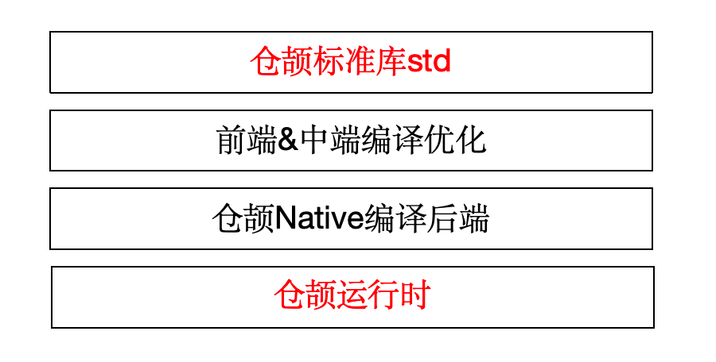

# 仓颉运行时与仓颉编程语言标准库

## 简介

仓颉运行时是仓颉 Native 后端（CJNative）的核心组件之一，以高性能和轻量化为设计目标，为仓颉语言在全场景下的高性能表现提供有力支持。更多仓颉运行时的介绍请参考： [仓颉运行时](https://gitcode.com/Cangjie/cangjie_runtime/blob/main/runtime/README_zh.md)

仓颉编程语言标准库 std 模块，为开发者提供了最通用的 API，包括输入输出功能、基础数据结构和算法、日期和时间表示等。更多仓颉编程语言标准库的介绍请参考： [仓颉编程语言标准库](https://gitcode.com/Cangjie/cangjie-runtime/blob/release-cangjie-merged/std/README_zh.md)



## 目录

```
/cangjie_runtime
├─ runtime                 # 仓颉运行时，包括内存管理模块、异常处理模块等
└─ std                     # 仓颉编程语言标准库 std 模块，为开发者提供了最通用的 API。
```

## 编译构建

[仓颉运行时构建指导](https://gitcode.com/Cangjie/cangjie_runtime/blob/main/runtime/README_zh.md)

[仓颉编程语言标准库构建指导](https://gitcode.com/Cangjie/cangjie_runtime/blob/release-cangjie-merged/std/README_zh.md#%E6%9E%84%E5%BB%BA%E5%87%86%E5%A4%87)

更多仓颉SDK集成构建请参考： [仓颉SDK集成构建指导书](https://gitcode.com/Cangjie/cangjie_build/blob/dev/README_zh.md)

## 相关仓

[cangjie_compiler](https://gitcode.com/Cangjie/cangjie_compiler)

[**cangjie_runtime**](https://gitcode.com/Cangjie/cangjie_runtime)

[cangjie_tools](https://gitcode.com/Cangjie/cangjie_tools)

[cangjie_stdx](https://gitcode.com/Cangjie/cangjie_stdx)

[cangjie_docs](https://gitcode.com/Cangjie/cangjie_docs)

[cangjie_build](https://gitcode.com/Cangjie/cangjie_build)

[cangjie_test](https://gitcode.com/Cangjie/cangjie_test)
