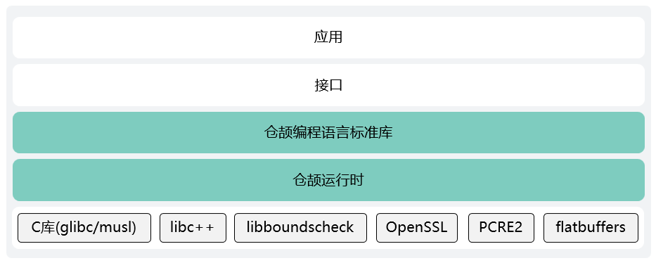
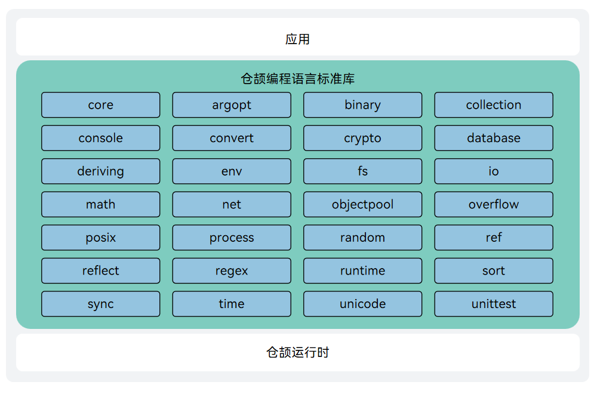

# 仓颉运行时与仓颉编程语言标准库

在仓颉编程语言中，程序执行依赖于运行时和标准库的能力。​仓颉运行时作为轻量高效的基础引擎，负责程序运行时的内存、线程等核心资源管理；仓颉语言标准库提供功能丰富的内置库，涉及数据结构、常用算法、数学计算、正则匹配、系统交互、文件操作、网络通信等功能，能够满足大部分开发需求。

本仓提供了仓颉运行时和仓颉编程语言标准库的源码，整体的架构图如下图所示：



> 三方库的使用方式
> - `libboundscheck` 的使用主体是仓颉运行时和仓颉编程语言标准库，使用方式是源码依赖，会编译集成到二进制发布包中。
> - `OpenSSL` 的使用主体是仓颉运行时，使用方式是动态链接系统中动态库，不依赖源码。
> - `PCRE2` 的使用主体是标准库 `regex`，使用方式是源码依赖，会编译集成到二进制发布包中。
> - `flatbuffers` 的使用主体是标准库 `ast`，使用方式是源码依赖，会编译集成到二进制发布包中。

开源组件依赖可参考[第三方库说明](./stdlib/third_party/README.md)。

下面对仓颉运行时和仓颉编程语言标准库进行详细介绍。

## 仓颉运行时

### 简介

仓颉运行时是仓颉 Native 后端（CJNative）的核心组件之一，以高性能和轻量化为设计目标，为仓颉语言在全场景下的高性能表现提供有力支持。仓颉运行时作为仓颉程序运行的基础引擎，提供了自动内存管理、线程管理、包管理等基础驱动功能。

### 系统架构

仓颉运行时的架构图如下所示：


**仓颉运行时架构图说明**

- **自动内存管理**使用了低时延的全并发内存整理算法，其核心目标是追求更低的业务时延与更低的内存开销，帮助开发者更好地聚焦业务本身。
    - 全并发垃圾回收：消除全局暂停（Stop-The-World, STW），优化执行时延。
    - 内存整理：通过对象搬移整理堆内存，提高内存利用率，支持应用长时在线。
    - 指针标记：在引用对象处对指针加上标记，以区分指针是垃圾内存还是被复用的新内存，保证全并发垃圾回收的正确性。

- **线程管理**提供了更轻量，更具弹性能力的线程管理方案，能更好地应对各种体量的并发场景。
    - 仓颉线程调度：包含了执行线程、监视器、处理器、调度器等基本模块。各个模块承担不同的任务，使得仓颉进程可以在充分利用多核心硬件资源的基础上进一步扩展并发能力。
    - 仓颉栈扩缩容：仓颉栈采用连续栈，当使用达到上限之后，自动扩容至 2 倍大小。

- **异常管理**提供了两类异常处理方式。从严重程度可分为 `Exception` 和 `Error` ：
    - `Exception` 类描述的是程序运行时的逻辑错误或者 `IO` 错误导致的异常，例如数组越界或者试图打开一个不存在的文件等。这类异常需要在程序中捕获处理。
    - `Error` 类描述仓颉语言运行时，系统内部错误和资源耗尽错误，应用程序不应该抛出这种类型的错误，如果出现内部错误，只能通知给用户，尽快安全终止程序。

- **回栈**使用了基于 `frame pointer` 的栈回溯方式。即使用 `rbp` 寄存器保存栈帧地址，`rsp` 寄存器保存栈顶指针，在过程调用时将上一个栈帧地址入栈保存。

- **包管理**支持以仓颉包为粒度加载和管理仓颉代码，支持反射特性。

- **仓颉对象模型**包含仓颉对象元数据、成员信息、方法信息和方法表。为仓颉对象的创建、管理、调用和释放提供支持。

- **跨语言调用**通过外部函数接口实现仓颉语言和 `C` 语言、`ArkTs` 语言之间的函数调用和数据交互。

- **DFX**提供日志打印、`CPU` 采集、堆快照导出等调试调优功能，支持运行时状态检测和故障排查。

### 目录

```
/cangjie_runtime
├── runtime
│   ├── build            # 构建脚本
│   └── src
│       ├── Base         # 日志等基础能力模块
│       ├── CJThread     # 仓颉线程管理模块
│       ├── Common       # 通用模块
│       ├── Concurrency  # 并发管理模块
│       ├── CpuProfiler  # CPU 采集工具
│       ├── Demangler    # 符号去混淆工具
│       ├── Exception    # 异常处理模块
│       ├── Heap         # 内存管理模块
│       ├── Inspector    # DFX 工具
│       ├── Loader       # 加载器 
│       ├── Mutator      # GC 与业务线程状态同步模块
│       ├── ObjectModel  # 对象模型
│       ├── Signal       # 信号管理模块
│       ├── StackMap     # 回栈元数据分析模块
│       ├── Sync         # 同步原语实现模块
│       ├── UnwindStack  # 回栈模块
│       ├── Utils        # 工具类
│       ├── arch      # 硬件平台适配代码
│       └── os           # 软件平台适配代码
└── stdlib
```

### 约束

当前暂不支持 Windows 环境内对仓颉运行时进行构建，需要在 Linux 环境内通过交叉编译方式生成可在 Windows 平台运行的仓颉运行时产物，详见[仓颉SDK集成构建指导书](https://gitcode.com/Cangjie/cangjie_build/blob/dev/README_zh.md)。未来支持计划具体见[平台支持计划](#平台支持计划)。

### 编译构建

仓颉运行时可通过源码进行构建，详细请参阅[构建仓颉运行时](./runtime/build_runtime_zh.md)。

### 使用说明

运行时独立构建产物需要配合cjc编译器及标准库等使用，整体可在 Linux、macOS、Windows 与 OpenHarmony 系统上直接运行。具体集成方式请查看[仓颉SDK集成构建指导书](https://gitcode.com/Cangjie/cangjie_build/blob/dev/README_zh.md)。

## 仓颉编程语言 - 标准库（std）

### 简介

仓颉编程语言标准库（std）是官方提供的一套核心库，预先定义了一组函数、类、结构体等，旨在提供常用的功能和工具，以便开发者能够更快速、更高效地编写程序。

仓颉标准库有其三项特点和追求：

- 使用方便：标准库随编译器、工具链一起发布，不需要用户另外下载，开箱即用。
- 功能通用：标准库提供了开发者最常使用的一些库能力，旨在为开发者解决大部分基础问题。
- 质量标杆：标准库追求在性能、代码风格等方面为其他仓颉库树立范例和标杆。


标准库的详细介绍和使用可以参见[仓颉编程语言标准库 API](./stdlib/doc/libs/summary_cjnative.md)。

### 系统架构

仓颉标准库的架构图如下所示：



### 目录

主要目录如下：

```
/cangjie_runtime
├── runtime
└── stdlib
    └── libs
        └── std
            ├── argopt      # 命令行参数字符串解析
            ├── ast         # 语法解析器
            ├── binary      # 提供了基础数据类型和二进制字节数组的不同端序转换接口，以及端序反转接口
            ├── collection  # 常见数据结构的实现、相关抽象的接口的定义以及在集合类型中常用的函数功能
            ├── console     # 提供和标准输入、标准输出、标准错误进行交互的方法。
            ├── convert     # 提供从字符串转到特定类型的 Convert 系列函数以及提供格式化能力
            ├── core        # 标准库的核心包
            ├── crypto      # 对称加解密和常用摘要算法能力
            ├── database    # 仓颉访问数据库能力
            ├── deriving    # 提供一组宏来自动生成接口实现
            ├── env         # 提供当前进程的相关信息与功能
            ├── fs          # 文件库
            ├── io          # 提供程序与外部设备进行数据交换的能力
            ├── math        # 数学库
            ├── net         # 网络通信
            ├── objectpool  # 对象缓存
            ├── overflow    # 溢出处理
            ├── posix       # 适配 POSIX 系统调用，提供跨平台的系统操作接口
            ├── process     # 进程库
            ├── random      # 提供生成伪随机数的能力
            ├── ref         # 提供了弱引用相关的能力
            ├── reflect     # 反射功能
            ├── regex       # 正则库
            ├── runtime     # 运行时交互
            ├── sort        # 排序
            ├── sync        # 并发编程
            ├── time        # 时间库
            ├── unicode     # 字符处理
            └── unittest    # 用于编写仓颉项目单元测试代码
```

### 约束

当前暂不支持 Windows 环境内对仓颉编程语言标准库进行构建，需要在 Linux 环境内通过交叉编译方式生成可在 Windows 平台运行的标准库产物，详见[仓颉SDK集成构建指导书](https://gitcode.com/Cangjie/cangjie_build/blob/dev/README_zh.md)。未来支持计划具体见[平台支持计划](#平台支持计划)。

### 编译构建

仓颉标准库可通过源码进行构建，详细请参阅[构建仓颉标准库](./stdlib/build_std_zh.md)。

### 使用说明

标准库构建产物需要配合 cjc 编译器及运行时等使用，整体可在 Linux、macOS、Windows 与 OpenHarmony 系统上直接运行。具体集成方式请查看[仓颉SDK集成构建指导书](https://gitcode.com/Cangjie/cangjie_build/blob/dev/README_zh.md)。

## 平台支持计划
- 构建平台演进：计划于2025年底支持 Windows 构建出仓颉运行时和标准库产物。
- 仓颉应用运行平台演进：计划 2025 Q3 支持仓颉应用在 OHOS-ARM32 平台运行，但反射、动态加载、部分编译器优化如 LTO（Link-Time Optimization）暂不支持。

## 相关仓

[cangjie_compiler](https://gitcode.com/openharmony-sig/third_party_cangjie_compiler)

[cangjie_tools](https://gitcode.com/openharmony-sig/third_party_cangjie_tools)

[cangjie_stdx](https://gitcode.com/openharmony-sig/third_party_cangjie_stdx)

[cangjie_docs](https://gitcode.com/Cangjie/cangjie_docs)

[cangjie_build](https://gitcode.com/Cangjie/cangjie_build)

[cangjie_test](https://gitcode.com/Cangjie/cangjie_test)

## 开源协议

本项目基于 [Apache-2.0 with Runtime Library Exception](./LICENSE)，请自由地享受和参与开源。

## 参与贡献

欢迎广大开发者贡献代码、文档等，具体的贡献流程和方式请参见[参与贡献](https://gitcode.com/openharmony/docs/blob/master/zh-cn/contribute/%E5%8F%82%E4%B8%8E%E8%B4%A1%E7%8C%AE.md)
