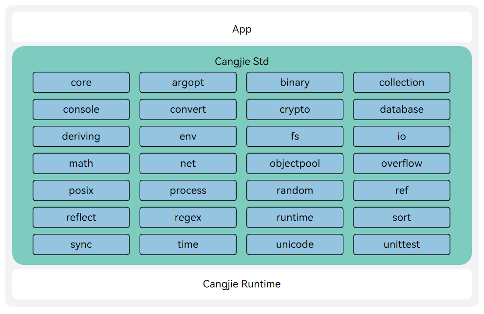

# Cangjie Programming Language Library

## Introduction

The Cangjie Programming Language Standard Library (std) is a library that comes bundled with the Cangjie SDK by default. The standard library pre-defines a set of functions, classes, structures, etc., aimed at providing common functionalities and tools to help developers write programs more quickly and efficiently.

The Cangjie Standard Library has three key characteristics and goals:

- Convenience: The standard library is distributed with the compiler and toolchain, requiring no additional downloads from users, making it ready to use right out of the box.
- Universal Functionality: The standard library provides the most commonly used library capabilities for developers, aiming to solve most basic problems.
- Quality Benchmark: The standard library strives to set an example and benchmark for other Cangjie libraries in terms of performance, code style, etc.


For a detailed introduction and usage of the standard library, please refer to the [official standard library documentation](https://cangjie-lang.cn/docs?url=%2F1.0.0%2Flibs%2Fstd%2Fstd_module_overview.html)

The Cangjie standard library (std) is built on a lower layer based on compiler frontend, middle-end, backend, and runtime, as shown in the figure.


## Directory

The main directories are as follows:

```
std/libs/std
├── argopt                  # Command line argument string parsing
├── ast                     # Syntax parser
├── binary                  # Provides interfaces for endian conversion of basic data types and binary byte arrays, as well as endian reversal interfaces
├── collection              # Implementation of common data structures, definition of relevant abstract interfaces, and common function features in collection types
├── console                 # Provides methods for interacting with standard input, standard output, and standard error
├── convert                 # Provides Convert series functions for converting from strings to specific types and formatting capabilities
├── core                    # Core package of the standard library
├── crypto                  # Symmetric encryption/decryption and common digest algorithm capabilities
├── database                # Cangjie database access capabilities
├── deriving                # Provides a set of macros to automatically generate interface implementations
├── env                     # Provides information and functionality related to the current process
├── fs                      # File library
├── io                      # Provides the ability for programs to exchange data with external devices
├── math                    # Math library
├── net                     # Network communication
├── objectpool              # Object caching
├── overflow                # Overflow handling
├── posix                   # POSIX system interface adaptation
├── process                 # Process library
├── random                  # Provides the ability to generate pseudo-random numbers
├── ref                     # Provides weak reference capabilities
├── reflect                 # Reflection functionality
├── regex                   # Regular expression library
├── runtime                 # Runtime interaction
├── sort                    # Sorting
├── sync                    # Concurrent programming
├── time                    # Time library
├── unicode                 # Character processing
└── unittest                # For writing unit test code for Cangjie projects
```


## Compilation and Building

### Build Preparation

The Cangjie standard library can be built in Ubuntu/MacOS (x86_64, aarch64) environments. Before building, you need to set up the compilation environment. For details, please check the [Build dependency tool](https://gitcode.com/Cangjie/cangjie_build/blob/dev/docs/env_zh.md)


### Build Steps

Before building the standard library, you need to first build the runtime in this repository and [cangjie_compiler](https://gitcode.com/Cangjie/cangjie_compiler). For detailed build instructions for runtime and cangjie_compiler, please refer to their respective project build guides.

1. Configure cjc

   ```
   source <path to the source-built cjc, e.g., ..../output/envsetup.sh>
   ```

   You can verify if cjc is configured successfully using the command below. If version information appears, it indicates that cjc is configured successfully.


   ```
   cjc -v
   ```

2. Build Commands

   Download the source code

   ```
   git clone https://gitcode.com/Cangjie/cangjie_runtime.git
   ```

   Enter the std directory, compile the standard library source code by executing the `build.py` script, which supports three functions: build, clean, and install.


   ```
   cd std
   python3 build.py clean
   python3 build.py build -t release --target-lib=<path to runtime build output directory> --target-lib=<path to openssl lib>
   python3 build.py install
   ```

   1. `build.py clean` command is used to clear temporary files in the workspace;
   2. `build.py build` command starts the compilation：
      - `-t` or `--build-type`，specifies the type of build artifact, which can be either `release` or `debug`;
      - `--target-lib` specifies the openssl lib directory and the output directory for runtime binary artifacts(By default, it is under runtime/output)
   3. `build.py install` ommand installs the build artifacts to the `output` directory.
      - `--prefix` specifies the installation path (optional), by default it installs in the std/output directory

The output directory structure is as follows:

```
output
├── lib     #std static lib
├── modules #std cjo file
└── runtime #std dynamic lib
```


### Usage Instructions

The standard library build artifacts need to be used with the cjc compiler and runtime, etc. For specific integration methods, please see the [Cangjie SDK Integration Build Guide](https://gitcode.com/Cangjie/cangjie_build)

### More Build Options

The build functionality of build.py provides the following additional options:

- --target: Specifies the build platform, defaults to native build, supported targets are shown below(For cross-compilation, please refer to [Cangjie SDK Integration Build Guide](https://gitcode.com/Cangjie/cangjie_build/blob/dev/README_zh.md)):
  - native (default value)
  - ohos-aarch64: Cross-compile for ohos(ohos-aarch64)
  - ohos-x86_64: Cross-compile for ohos(ohos-x86_64)
  - windows-x86_64: Cross-compile Windows from Linux
- --target-toolchain: Specifies the path to compilation tools (required for cross-compilation)
- --target-sysroot: Specifies the directory of target system libraries (required for cross-compilation)
- --build-args: cjc build options (optional)
- --jobs(-j): maximum number of concurrent build tasks
- --hwasan：Building the HWASAN version of std (for OHOS cross-compilation)

The install functionality of build.py provides the following additional options:

- --prefix: Specifies the installation directory
- --host: Specifies which target platform to install for

You can also refer to [build.py](https://gitcode.com/Cangjie/cangjie_runtime/blob/release-cangjie-merged/std/build.py) or use the `--help` option to learn more about compilation options:

```
python3 build.py --help
python3 build.py build --help
python3 build.py install --help
```

### Integration Build Guide

For integration building, please refer to the [Cangjie SDK Integration Build Guide](https://gitcode.com/Cangjie/cangjie_build/blob/dev/README_zh.md).

## Repositories Involved

[cangjie_compiler](https://gitcode.com/Cangjie/cangjie_compiler)

[**cangjie_runtime**](https://gitcode.com/Cangjie/cangjie_runtime)

[cangjie_tools](https://gitcode.com/Cangjie/cangjie_tools)

[cangjie_stdx](https://gitcode.com/Cangjie/cangjie_stdx)

[cangjie_docs](https://gitcode.com/Cangjie/cangjie_docs)

[cangjie_build](https://gitcode.com/Cangjie/cangjie_build)

[cangjie_test](https://gitcode.com/Cangjie/cangjie_test)