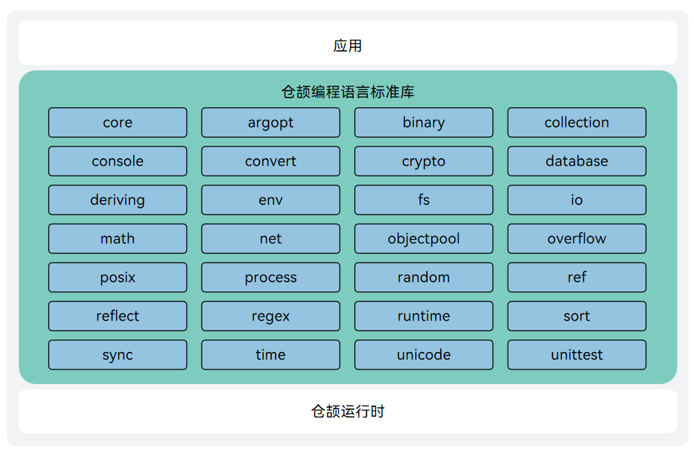

# 仓颉编程语言标准库

## 简介

仓颉编程语言标准库（std）是安装仓颉 SDK 时默认自带的库。标准库预先定义了一组函数、类、结构体等，旨在提供常用的功能和工具，以便开发者能够更快速、更高效地编写程序。

仓颉标准库有其三项特点和追求：

- 使用方便：标准库随编译器、工具链一起发布，不需要用户另外下载，开箱即用。
- 功能通用：标准库提供了开发者最常使用的一些库能力，旨在为开发者解决大部分基础问题。
- 质量标杆：标准库追求在性能、代码风格等方面为其他仓颉库树立范例和标杆。

标准库的详细介绍和使用可以参见[官网标准库文档](https://cangjie-lang.cn/docs?url=%2F1.0.0%2Flibs%2Fstd%2Fstd_module_overview.html)

仓颉标准库std底层基于编译前端&中端&后端以及运行时，如图所示


## 目录

主要目录如下：

```
std/libs/std
├── argopt                  #命令行参数字符串解析
├── ast 				    #语法解析器
├── binary 					#提供了基础数据类型和二进制字节数组的不同端序转换接口，以及端序反转接口
├── collection              #常见数据结构的实现、相关抽象的接口的定义以及在集合类型中常用的函数功能
├── console  				#提供和标准输入、标准输出、标准错误进行交互的方法。
├── convert 				#提供从字符串转到特定类型的 Convert 系列函数以及提供格式化能力
├── core 					#标准库的核心包
├── crypto 					#对称加解密和常用摘要算法能力
├── database 				#仓颉访问数据库能力
├── deriving 				#提供一组宏来自动生成接口实现
├── env  					#提供当前进程的相关信息与功能
├── fs 						#文件库
├── io 						#提供程序与外部设备进行数据交换的能力
├── math 				    #数学库
├── net 					#网络通信
├── objectpool 			    #对象缓存
├── overflow 				#溢出处理
├── posix 					#适配POSIX系统接口
├── process 				#进程库
├── random 					#提供生成伪随机数的能力
├── ref 					#提供了弱引用相关的能力
├── reflect  				#反射功能
├── regex 					#正则库
├── runtime 				#运行时交互
├── sort 					#排序
├── sync 					#并发编程
├── time 					#时间库
├── unicode 				#字符处理
└── unittest 				#用于编写仓颉项目单元测试代码
```


## 编译构建

### 构建准备

支持在 Ubuntu/MacOS(x86_64, aarch64) 环境中对仓颉标准库进行构建。构建前需要完成编译环境的搭建，详情请查看[构建依赖工具](https://gitcode.com/Cangjie/cangjie_build/blob/dev/docs/env_zh.md)

### 构建步骤

构建标准库之前需要先源码构建本仓的runtime和[cangjie_compiler](https://gitcode.com/Cangjie/cangjie_compiler)，runtime和cangjie_compiler的构建详细见其项目的构建指导。

1. 配置cjc

   ```
   source <源码构建的cjc路径，如..../output/envsetup.sh>
   ```

   可以通过下面的命令验证cjc是否配置成功，若出现版本信息，证明cjc配置成功

   ```
   cjc -v
   ```

2. 构建命令

   下载源码

   ```
   git clone https://gitcode.com/Cangjie/cangjie_runtime.git
   ```

   进入std目录，对标准库源码进行编译，执行 `build.py` 脚本，脚本支持构建、清理、和安装三个功能

   ```
   cd std
   python3 build.py clean
   python3 build.py build -t release --target-lib=<runtime构建产物路径> --target-lib=<openssl lib路径>
   python3 build.py install
   ```

   1. `build.py clean` 命令用于清空工作区临时文件；
   2. `build.py build` 命令开始执行编译：
      - `-t` 即 `--build-type`，指定编译产物类型，可以是 `release` 或 `debug`；
      - `--target-lib` 指定openssl lib目录和runtime二进制产物output目录(默认在项目的runtime/output)
   3. `build.py install` 命令将编译产物安装到 `output` 目录下。
      - `--prefix` 指定安装路径（可选），默认安装在std/output目录

output目录结构如下：

```
output
├── lib     #标准库static lib
├── modules #标准库cjo文件
└── runtime #标准库dynamic lib
```


### 使用说明

标准库构建产物需要配合cjc编译器及运行时等使用，具体集成方式请查看[仓颉SDK集成构建指导书](https://gitcode.com/Cangjie/cangjie_build)

​		

### 更多构建选项

build.py的build功能提供如下额外选项：

- --target：指定构建平台，默认为native，支持的target如下所示（交叉编译请参考[仓颉SDK集成构建指导书](https://gitcode.com/Cangjie/cangjie_build)）：
  - native（默认值）
  - ohos-aarch64 ： 交叉编译ohos(aarch64)
  - ohos-x86_64 ：交叉编译ohos(x86_64)
  - windows-x86_64 ： linux交叉编译windows
- --target-toolchain：指定编译工具所在路径（交叉编译需要指定）
- --target-sysroot ：指定编译目标系统库所在目录（交叉编译需要指定）
- --build-args ：cjc构建选项（可选）
- --jobs(-j): 并发构建任务最大数量
- --hwasan：构建hwasan版本std（OHOS交叉编译使用）


build.py的install功能提供如下额外选项：

- --prefix：指定安装目录
- --host：指定为哪个target平台安装


您也可以参阅 [build.py](https://gitcode.com/Cangjie/cangjie_runtime/blob/release-cangjie-merged/std/build.py) 或通过 `--help` 选项了解更多编译选项：

```
python3 build.py --help
python3 build.py build --help
python3 build.py install --help
```

### 集成构建指导

集成构建请参阅 [仓颉 SDK 集成构建指导书](https://gitcode.com/Cangjie/cangjie_build/blob/dev/README_zh.md)。

## 相关仓

[cangjie_compiler](https://gitcode.com/Cangjie/cangjie_compiler)

[**cangjie_runtime**](https://gitcode.com/Cangjie/cangjie_runtime)

[cangjie_tools](https://gitcode.com/Cangjie/cangjie_tools)

[cangjie_stdx](https://gitcode.com/Cangjie/cangjie_stdx)

[cangjie_docs](https://gitcode.com/Cangjie/cangjie_docs)

[cangjie_build](https://gitcode.com/Cangjie/cangjie_build)

[cangjie_test](https://gitcode.com/Cangjie/cangjie_test)